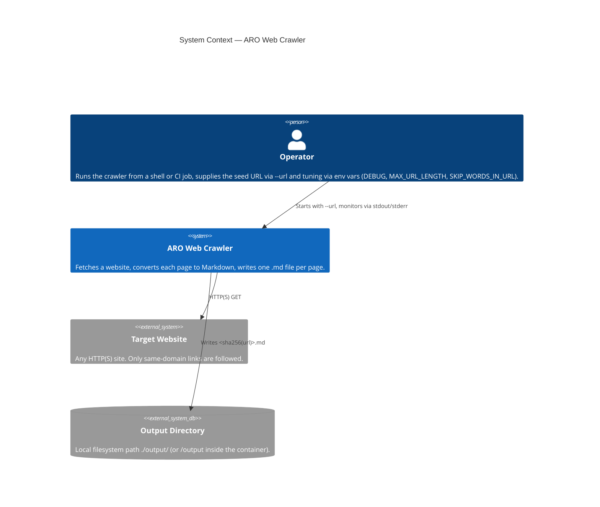
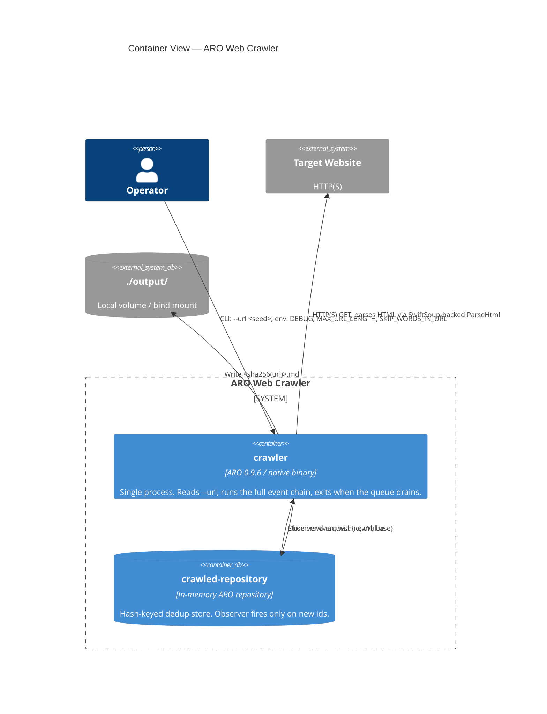
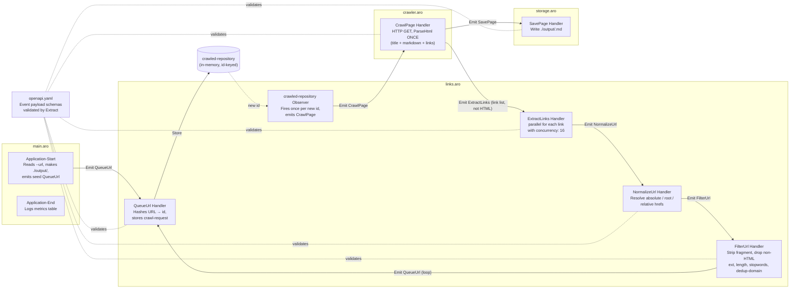
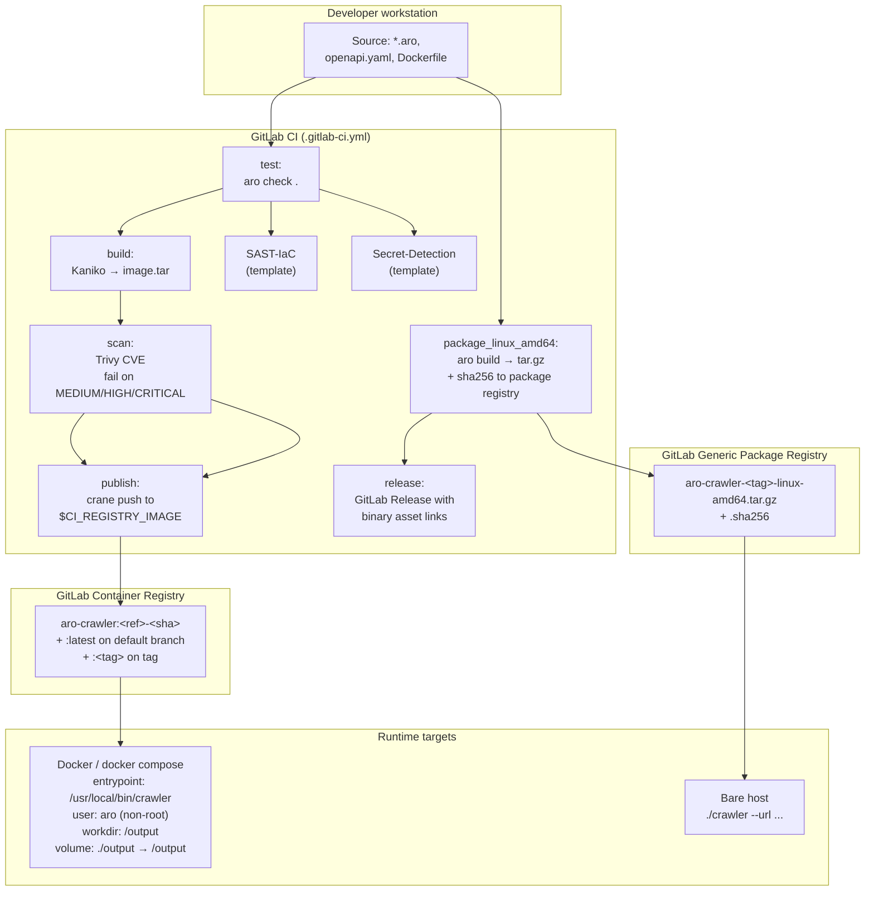
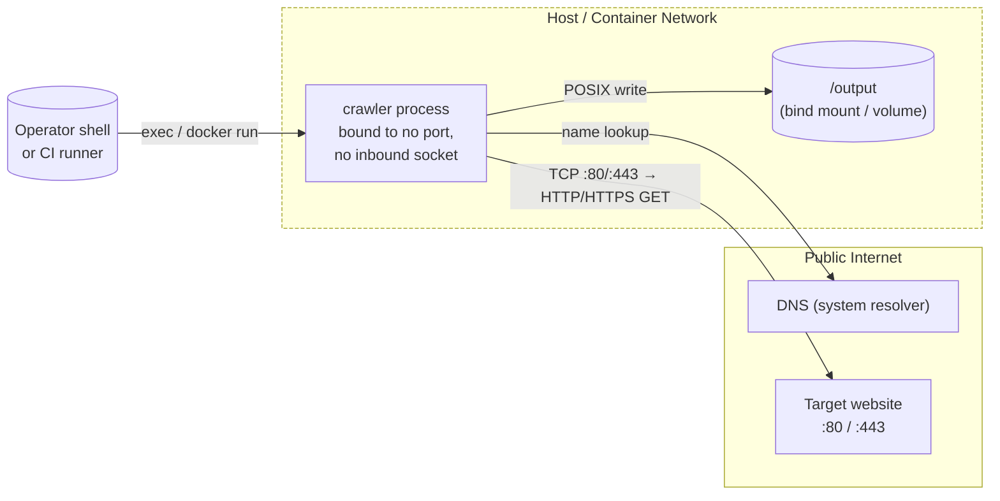
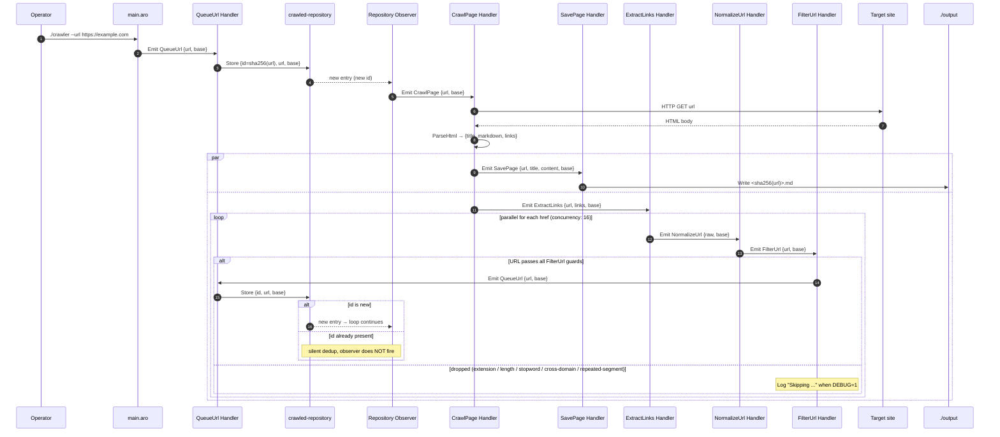
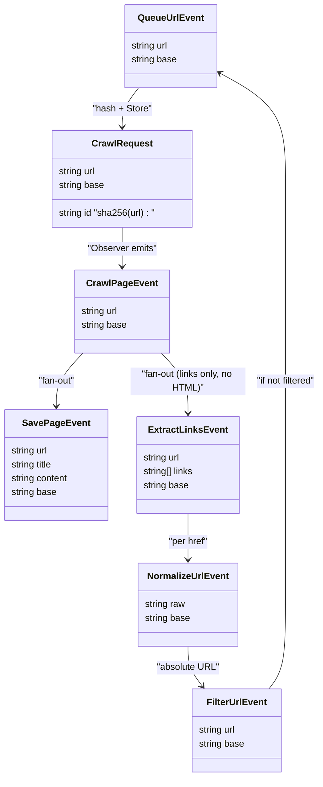

# Architecture

The ARO Web Crawler is a single-binary, event-driven web crawler written in [ARO](https://arolang.github.io/aro/). It accepts a seed URL on the command line, fetches HTML over HTTP(S), converts each page to Markdown, and writes one `.md` file per page to `./output/`. There is no database, no message broker, no inbound network surface — only outbound HTTP and a local filesystem write. The whole crawl runs as one OS process; concurrency comes from ARO's in-process event-handler scheduler, capped at 16 parallel link normalizations per page.

The diagrams below are generated from facts in this repository only: the four `.aro` source files, `openapi.yaml`, `Dockerfile`, `docker-compose.yml`, and `.gitlab-ci.yml`. They are written in Mermaid because (a) the project is small enough that C4-DSL/PlantUML would be overkill, (b) GitLab renders Mermaid natively in Markdown and Wiki pages, and (c) the rest of the docs are Markdown-first.

## 1. System Context (C4 Level 1)

A single actor — the operator who runs `crawler --url ...` — directs the crawler at a target website. The crawler reads HTML from that target and writes Markdown to the local filesystem. There are no other inbound or outbound connections at runtime.

## 2. Container Diagram (C4 Level 2)

The deployable surface is one container image (or one native binary). At runtime the only persistent boundary is the mounted output volume. The build pipeline pulls two upstream images from GitHub Container Registry but those are build/runtime base layers, not separately deployed containers.

## 3. Component Diagram (C4 Level 3)

The crawler's internals are five feature sets distributed across four `.aro` files plus the implicit `crawled-repository`. Feature sets never call each other directly — communication is exclusively `Emit a <SomeEvent: event>` plus the repository observer that drives the crawl loop.

## 4. Deployment Diagram

Two release channels are produced by `.gitlab-ci.yml`: a container image (Kaniko-built, Trivy-scanned, `crane`-pushed to the project's container registry) and, on tag pushes, a `linux-amd64` native binary uploaded to the GitLab generic package registry and attached to a GitLab Release.

## 5. Network Topology

The crawler has zero inbound listeners. The only outbound network is HTTP(S) to whatever site the operator passes via `--url`. Same-domain filtering in `FilterUrl Handler` means the crawl stays within one origin per invocation. There are no service-to-service calls, no auth proxies, no service mesh.

## 6. Event Sequence — One Page Through the Pipeline

The most useful operational view of this system is the sequence a single URL traverses from seed to written `.md`. Dedup short-circuits the loop at `QueueUrl Handler`: a repeat `Store` is silently dropped by the repository and the observer never fires, so no second crawl happens.

## 7. Event Payload Relationships

There is no relational schema, but `openapi.yaml` defines six event payloads plus one repository record. The diagram below shows which event carries which fields and how they connect — closest thing to an ER diagram this project has.

## What's intentionally not in this document

- **Class diagram.** ARO is event-driven prose, not OO. There are no classes, interfaces, or inheritance trees to draw.
- **Multi-environment deployment.** There is no dev/staging/prod distinction in the repository. The image and binary are produced once per ref / tag and run wherever the operator launches them.
- **Authentication / RBAC.** The crawler has no users beyond the OS user that launches it (`aro` inside the container), and no inbound surface to protect.
- **Database / cache topology.** The repository is in-memory and process-local. It does not survive a restart, by design — the crawl is one-shot.
- **Service-to-service network policies.** Single-process, no peer services.
