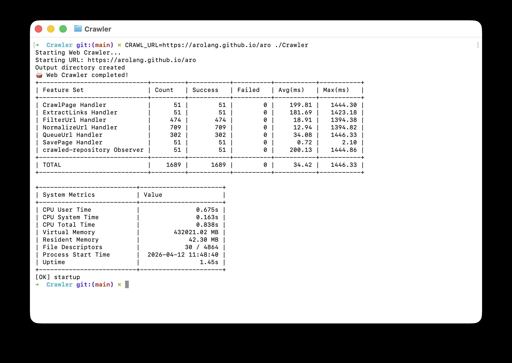

# ARO Web Crawler

A web crawler built with [ARO](https://github.com/arolang/aro) that crawls a website, extracts content as Markdown, and saves each page to disk.

[](https://github.com/arolang/aro)



## Quick Start

```bash
# Set your target URL and run
CRAWL_URL=https://example.com aro run .

# Check the results
ls output/
```

For verbose output:

```bash
DEBUG=1 CRAWL_URL=https://example.com aro run .
```

## How It Works

The crawler is fully event-driven. No feature set calls another directly -- they communicate exclusively through events and a repository observer:

```
Application-Start
       |
       v
  QueueUrl event ───> QueueUrl Handler
                           |
                      Store into crawled-repository
                           |
                      crawled-repository Observer
                           |
                      CrawlPage event ───> CrawlPage Handler
                                                |
                                    ┌───────────┴───────────┐
                                    v                       v
                              SavePage event          ExtractLinks event
                                    |                       |
                              SavePage Handler        ExtractLinks Handler
                              (write .md file)              |
                                                   parallel for each link:
                                                            |
                                                   NormalizeUrl Handler
                                                            |
                                                   FilterUrl Handler
                                                            |
                                                   QueueUrl event ──┐
                                                                    |
                                               (loops back, repo   |
                                                deduplicates)  <───┘
```

URL deduplication happens automatically: the repository ignores stores with duplicate IDs (each URL is hashed to a deterministic ID). The observer only fires for new entries.

## Project Structure

```
Crawler/
├── main.aro        # Entry point: reads CRAWL_URL, creates output dir, emits first QueueUrl
├── crawler.aro     # CrawlPage Handler: fetches HTML, extracts Markdown, emits SavePage + ExtractLinks
├── links.aro       # Link pipeline: ExtractLinks, NormalizeUrl, FilterUrl, QueueUrl, repository Observer
├── storage.aro     # SavePage Handler: writes Markdown files to output/
├── openapi.yaml    # Event schemas (CrawlPageEvent, ExtractLinksEvent, etc.)
└── output/         # Crawled pages as .md files (created at runtime)
```

~200 lines of ARO code total.

## Features Demonstrated

| Feature | Where | Description |
|---------|-------|-------------|
| Event-driven architecture | All files | Feature sets communicate through events, never directly |
| Repository observer | `links.aro` | `crawled-repository Observer` reacts to new entries |
| Repository deduplication | `links.aro` | Storing with a hash ID prevents re-crawling visited URLs |
| Parallel iteration | `links.aro` | `parallel for each` processes extracted links concurrently |
| Pattern matching | `links.aro` | `match` with regex classifies URLs (absolute, root-relative, relative, skip) |
| Typed event extraction | `crawler.aro` | `Extract the <data: CrawlPageEvent> from the <event>` validates against OpenAPI schema |
| HTML parsing | `crawler.aro` | `ParseHtml` extracts Markdown content and links |
| Conditional logging | All files | `when <env: DEBUG> == "1"` gates verbose output on an environment variable |
| Contract-first schemas | `openapi.yaml` | Event payloads defined as OpenAPI component schemas |

## Output Format

Each crawled page is saved as a Markdown file named by the SHA-256 hash of its URL:

```markdown
# Page Title

**Source:** https://example.com/page

---

Content with headings, links, lists, and formatting preserved...
```

## Run with Docker

```bash
# Using docker compose
docker compose up

# Or manually
docker build -t aro-crawler .
docker run -e CRAWL_URL=https://example.com -v $(pwd)/output:/output aro-crawler
```

## Compile to Native Binary

```bash
aro build . --optimize
./Crawler    # or .build/Crawler depending on platform
```

## License

MIT
